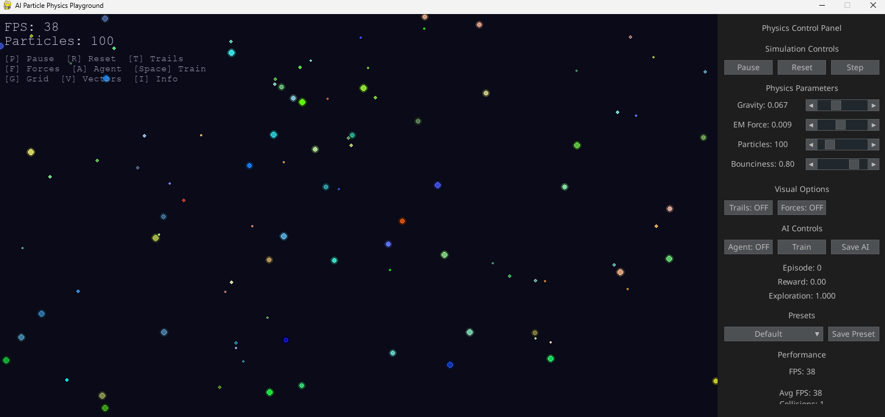

# AI Particle Physics Playground

## Table of Contents

1. [Project Overview](#project-overview)
2. [System Architecture](#system-architecture)
3. [Core Components](#core-components)
4. [Features](#features)
5. [Configuration System](#configuration-system)
6. [AI/Reinforcement Learning](#ai-reinforcement-learning)
7. [Installation & Usage](#installation--usage)
8. [API Reference](#api-reference)
9. [Potential Improvements](#potential-improvements)

---

## Project Overview

### Description

The AI Particle Physics Playground is an advanced physics simulation environment that combines real-time particle dynamics with reinforcement learning capabilities. It features a sophisticated N-body physics engine simulating gravitational and electromagnetic forces, coupled with a Deep Q-Network (DQN) agent that learns to navigate and survive in this dynamic environment.



### Key Objectives

- **Educational**: Demonstrate complex physics interactions in an intuitive visual format
- **Research**: Provide a testbed for reinforcement learning algorithms in continuous physics environments
- **Interactive**: Offer real-time parameter adjustment and visualization tools
- **Extensible**: Support multiple physics configurations and AI training scenarios

### Technology Stack

- **Core**: Python 3.x
- **Graphics**: Pygame for real-time rendering
- **GUI**: pygame_gui for control panels
- **AI**: PyTorch for deep reinforcement learning
- **Physics**: NumPy for vectorized physics calculations
- **Data**: JSON for configuration and logging

---

## System Architecture

### High-Level Architecture

```
┌─────────────────┐    ┌─────────────────┐    ┌─────────────────┐
│   Main App      │ ←→ │ Physics Engine  │ ←→ │ Particle System │
│   (main.py)     │    │  (physics.py)   │    │   (N-body)      │
└─────────────────┘    └─────────────────┘    └─────────────────┘
         │                       │                       │
         ▼                       ▼                       ▼
┌─────────────────┐    ┌─────────────────┐    ┌─────────────────┐
│   GUI System    │    │   Renderer      │    │  Configuration  │
│ (pygame_gui)    │    │  (render.py)    │    │   (config.py)   │
└─────────────────┘    └─────────────────┘    └─────────────────┘
         │                       │                       │
         ▼                       ▼                       ▼
┌─────────────────┐    ┌─────────────────┐    ┌─────────────────┐
│   RL Agent      │ ←→ │  Environment    │ ←→ │   Training      │
│ (rl_agent.py)   │    │(environment.py) │    │  (train.py)     │
└─────────────────┘    └─────────────────┘    └─────────────────┘
```

### Data Flow

1. **Configuration** → Physics parameters loaded/validated
2. **Physics Engine** → Calculates forces and integrates motion
3. **Renderer** → Visualizes particles and UI elements
4. **Environment** → Wraps physics for RL interface
5. **Agent** → Observes state, takes actions, learns from experience
6. **Training Monitor** → Tracks performance and saves results

---

## Core Components

### 1. Physics Engine (`physics.py`)

**Purpose**: Handles all particle dynamics and physics calculations

**Key Features**:

- **N-body Simulation**: Supports 10-1000+ particles simultaneously
- **Dual Force Systems**:
  - Gravitational forces (attractive, mass-dependent)
  - Electromagnetic forces (attractive/repulsive, charge-dependent)
- **Integration Methods**:
  - Euler integration (fast, less stable)
  - Verlet integration (slower, more stable)
- **Collision Detection**: Efficient pairwise collision detection
- **Collision Resolution**: Elastic collision physics with configurable restitution
- **Boundary Handling**: Wraparound screen boundaries

**Technical Details**:

```python
# Particle data structure: [x, y, vx, vy, mass, radius, charge]
particles = np.zeros((particle_count, 7), dtype=np.float32)

# Vectorized force calculations for O(N²) efficiency
displacements = positions[:, np.newaxis, :] - positions[np.newaxis, :, :]
forces = G * mass_products / distances_squared
```

### 2. Configuration System (`config.py`)

**Purpose**: Centralized parameter management with validation and presets

**Features**:

- **Structured Configuration**: Separate dataclasses for Physics, Display, and AI parameters
- **Validation**: Comprehensive parameter range checking and error reporting
- **Preset System**: Pre-defined configurations for different scenarios
- **Dynamic Updates**: Runtime parameter modification with immediate effect
- **Persistence**: Save/load configurations to/from JSON files

**Configuration Categories**:

#### Physics Parameters

| Parameter                 | Range    | Description                |
| ------------------------- | -------- | -------------------------- |
| `G`                       | 0.0-0.2  | Gravitational constant     |
| `K_E`                     | 0.0-0.02 | Electromagnetic constant   |
| `PARTICLE_COUNT`          | 10-1000  | Number of particles        |
| `MIN/MAX_MASS`            | >0       | Particle mass range        |
| `MIN/MAX_RADIUS`          | >0       | Particle size range        |
| `MIN/MAX_CHARGE`          | Any      | Charge range for EM forces |
| `RESTITUTION_COEFFICIENT` | 0.0-1.0  | Collision bounciness       |
| `USE_VERLET`              | Boolean  | Integration method choice  |

#### Display Parameters

| Parameter             | Range               | Description              |
| --------------------- | ------------------- | ------------------------ |
| `SCREEN_WIDTH/HEIGHT` | 640x480 - 3840x2160 | Resolution               |
| `FPS`                 | 30-120              | Target frame rate        |
| `BACKGROUND_COLOR`    | RGB                 | Background color         |
| `PARTICLE_COLORS`     | RGB                 | Mass-based color mapping |
| `UI_FONT_SIZE`        | 12-48               | Interface text size      |

### 3. Renderer (`render.py`)

**Purpose**: Advanced visualization with multiple rendering modes

**Rendering Features**:

- **Enhanced Particle Rendering**:
  - Mass-based color interpolation
  - HSV color space for charge/velocity mapping
  - Glow effects for visual appeal
  - Agent particle highlighting
- **Visualization Modes**:
  - Velocity vectors with magnitude-based coloring
  - Force vector visualization
  - Particle trails with fade effects
  - Background reference grid
  - Center of mass indicator
- **Information Overlays**:
  - Real-time performance metrics
  - Individual particle properties
  - System energy calculations
  - Interactive mouse-over details

**Technical Highlights**:

```python
# Advanced color mapping using HSV space
def _get_enhanced_particle_color(self, mass, charge, velocity, ...):
    hue = 240 * (1 - charge_norm)  # Blue(negative) to Red(positive)
    saturation = 0.3 + 0.7 * mass_norm  # Mass affects saturation
    brightness = 0.4 + 0.6 * vel_norm   # Velocity affects brightness
    return hsv_to_rgb(hue, saturation, brightness)
```

### 4. Environment Interface (`environment.py`)

**Purpose**: Gym-like RL environment wrapper for the physics engine

**RL Interface**:

- **State Space**: 22-dimensional observation vector
  - Agent velocity (2D)
  - Relative positions of k-nearest neighbors (normalized)
  - Relative velocities of k-nearest neighbors
- **Action Space**: 5 discrete actions (Up, Down, Left, Right, None)
- **Reward Structure**:
  - Small positive reward for survival (+0.1 per step)
  - Large negative penalty for collisions (-100.0)
- **Episode Termination**: Collision detection or maximum steps reached

### 5. RL Agent (`rl_agent.py`)

**Purpose**: Deep Q-Network implementation for learning navigation

**Architecture**:

- **Neural Network**: 3-layer fully connected DQN
  - Input: 22-dimensional state vector
  - Hidden layers: 64 neurons each with ReLU activation
  - Output: 5 Q-values (one per action)
- **Training Algorithm**: DQN with experience replay and target networks
- **Key Features**:
  - Experience replay buffer (100,000 transitions)
  - Target network with soft updates (τ=0.001)
  - ε-greedy exploration with decay
  - Batch training (64 samples)

### 6. Training System (`train.py`)

**Purpose**: Comprehensive training framework with monitoring and analysis

**Advanced Features**:

- **Training Monitor**:
  - Real-time performance tracking
  - Comprehensive logging and plotting
  - Best model checkpointing
  - Training data persistence
- **Adaptive Training**:
  - Learning rate scheduling based on performance
  - Adaptive epsilon decay
  - Early stopping with patience mechanism
- **Analysis Tools**:
  - Multi-metric performance plots
  - Configuration comparison framework
  - Training summary statistics

---

## Features

### Interactive GUI Controls

- **Real-time Parameter Adjustment**: Sliders for physics constants
- **Simulation Controls**: Pause, reset, single-step execution
- **Visual Options**: Toggle trails, forces, grids, and other overlays
- **Preset Management**: Quick switching between pre-configured scenarios
- **AI Controls**: Start/stop training, agent visualization, model saving

### Keyboard Shortcuts

| Key     | Function                    |
| ------- | --------------------------- |
| `P`     | Pause/Resume simulation     |
| `R`     | Reset simulation            |
| `T`     | Toggle particle trails      |
| `F`     | Toggle force vectors        |
| `A`     | Toggle agent highlighting   |
| `Space` | Toggle AI training mode     |
| `G`     | Toggle background grid      |
| `V`     | Toggle velocity vectors     |
| `I`     | Toggle particle information |

### Physics Presets

1. **Default**: Balanced gravity and EM forces for general exploration
2. **High Gravity**: Strong gravitational attraction, orbital mechanics focus
3. **Electromagnetic Chaos**: Dominant EM forces, complex charge interactions
4. **Orbital Mechanics**: Pure gravitational simulation with varying masses
5. **Quantum Simulation**: Weak gravity, strong EM, small particle sizes
6. **AI Training Optimized**: Tuned parameters for effective RL training

---

## Configuration System

### Preset Configuration Structure

```json
{
  "physics": {
    "G": 0.05,
    "K_E": 0.01,
    "PARTICLE_COUNT": 75,
    "RESTITUTION_COEFFICIENT": 0.7,
    "USE_VERLET": true
  },
  "display": {
    "SCREEN_WIDTH": 1280,
    "SCREEN_HEIGHT": 720,
    "FPS": 60
  },
  "ai": {
    "AGENT_FORCE_MAGNITUDE": 750.0,
    "BATCH_SIZE": 32,
    "LR": 0.001
  }
}
```

### Configuration Validation

The system includes comprehensive validation for all parameters:

- **Range Checking**: Ensures values are within acceptable bounds
- **Dependency Validation**: Checks parameter relationships (e.g., MIN < MAX)
- **Type Validation**: Verifies correct data types
- **Error Reporting**: Detailed error messages for invalid configurations

---

## AI/Reinforcement Learning

### Learning Algorithm: Deep Q-Network (DQN)

**Objective**: Train an agent to survive as long as possible while avoiding collisions

### State Representation (22 dimensions)

1. **Agent Velocity** (2D): Current velocity of the agent particle
2. **Neighbor Information** (20D): For 5 nearest particles:
   - Relative position (normalized by screen width)
   - Relative velocity

### Action Space

- **Action 0**: Apply upward force
- **Action 1**: Apply downward force
- **Action 2**: Apply leftward force
- **Action 3**: Apply rightward force
- **Action 4**: No action (drift)

### Reward Design

```python
reward = survival_bonus + collision_penalty
# survival_bonus = +0.1 per timestep
# collision_penalty = -100.0 on collision
```

### Training Features

- **Experience Replay**: Store and sample from past experiences
- **Target Network**: Stabilize training with slowly updated target Q-values
- **Epsilon Scheduling**: Balance exploration vs exploitation
- **Performance Monitoring**: Track scores, episode lengths, collision rates
- **Adaptive Hyperparameters**: Adjust learning rate and exploration based on performance

### Training Outputs

- **Model Checkpoints**: Saved at regular intervals and for best performance
- **Training Plots**: Score progression, epsilon decay, episode lengths
- **Performance Metrics**: Comprehensive training statistics
- **Configuration Logging**: Record of all hyperparameters used

---

## Installation & Usage

### Requirements

```bash
pip install pygame pygame-gui torch torchvision numpy matplotlib
```

### Basic Usage

```bash
# Run the interactive simulation
python main.py

# Run standalone training
python train.py

# Compare different configurations
python train.py  # Choose option 2
```

### Project Structure

```
physics_playground/
├── main.py              # Main application
├── config.py            # Configuration management
├── physics.py           # Physics engine
├── render.py            # Visualization system
├── environment.py       # RL environment wrapper
├── rl_agent.py         # DQN implementation
├── train.py            # Training framework
├── utils.py            # Utility functions
├── presets.json        # Saved presets (generated)
├── config.json         # Configuration file (generated)
└── training_logs/      # Training outputs (generated)
```

---

## API Reference

### Core Classes

#### `PhysicsEngine`

```python
class PhysicsEngine:
    def __init__(self, particle_count: int)
    def update(self, dt: float) -> None
    def apply_agent_action(self, action_index: int) -> None
```

#### `ConfigManager`

```python
class ConfigManager:
    def apply_preset(self, preset_name: str) -> bool
    def validate_all(self) -> List[str]
    def save_config(self) -> None
    def create_preset(self, name: str) -> None
```

#### `Agent`

```python
class Agent:
    def act(self, state: np.ndarray, eps: float = 0.0) -> int
    def step(self, state, action, reward, next_state, done) -> None
    def save(self, filename: str) -> None
    def load(self, filename: str) -> None
```

#### `ParticleEnv`

```python
class ParticleEnv:
    def reset(self) -> np.ndarray
    def step(self, action: int) -> Tuple[np.ndarray, float, bool]
```

---

## Potential Improvements

### High Priority Improvements

#### 1. **Performance Optimization**

- **Spatial Partitioning**: Implement quadtree or grid-based spatial partitioning for O(N log N) force calculations instead of current O(N²)
- **GPU Acceleration**: Port physics calculations to CUDA/OpenCL for massive parallelization
- **Adaptive Time Stepping**: Implement variable timesteps based on system energy/stability
- **Level of Detail**: Reduce calculation precision for distant particles

#### 2. **Enhanced Physics**

- **Relativistic Effects**: Add special relativity corrections for high-velocity particles
- **Magnetic Fields**: Implement magnetic forces for moving charged particles (Lorentz force)
- **Quantum Effects**: Add uncertainty principles, wave-particle duality visualization
- **Fluid Dynamics**: Support for continuous media alongside discrete particles
- **Thermodynamic Properties**: Temperature, pressure, entropy calculations and visualization

#### 3. **Advanced AI Features**

- **Multi-Agent Systems**: Multiple AI agents learning simultaneously with different objectives
- **Hierarchical RL**: Higher-level strategic planning with lower-level control
- **Curriculum Learning**: Progressive difficulty increase during training
- **Self-Play**: Competitive scenarios between AI agents
- **Imitation Learning**: Learn from human demonstrations or optimal trajectories

### Medium Priority Improvements

#### 4. **Visualization Enhancements**

- **3D Visualization**: Extend to 3D space with OpenGL/Vulkan rendering
- **VR/AR Support**: Immersive physics exploration
- **Advanced Shader Effects**: Particle systems, bloom, motion blur
- **Data Visualization**: Real-time plots of energy, momentum, temperature
- **Recording/Playback**: Save and replay interesting simulations

#### 5. **User Interface Improvements**

- **Node-Based Editor**: Visual programming interface for physics scenarios
- **Better Mobile Support**: Touch controls and responsive design
- **Web Version**: Port to WebGL/WebAssembly for browser compatibility
- **Plugin System**: Allow custom physics modules and visualization plugins
- **Collaborative Features**: Multi-user simulations and shared configurations

#### 6. **Scientific Features**

- **Measurement Tools**: Distance, angle, velocity measurement overlays
- **Data Export**: Export particle trajectories, forces, energies to CSV/HDF5
- **Statistical Analysis**: Built-in analysis of system properties over time
- **Experimental Design**: A/B testing framework for physics parameters
- **Educational Content**: Guided tutorials and physics concept explanations

### Low Priority Improvements

#### 7. **Technical Enhancements**

- **Better Error Handling**: More robust error recovery and user feedback
- **Automated Testing**: Unit tests for physics accuracy and performance regression
- **Continuous Integration**: Automated testing and deployment pipeline
- **Documentation**: Interactive API documentation with examples
- **Localization**: Multi-language support for international users

#### 8. **Advanced Training Features**

- **Distributed Training**: Multi-GPU and multi-node training support
- **Hyperparameter Optimization**: Automated hyperparameter tuning (Optuna, Ray Tune)
- **Meta-Learning**: Learning to learn across different physics configurations
- **Evolutionary Strategies**: Alternative to RL for agent optimization
- **Transfer Learning**: Adapt trained models to new physics scenarios

#### 9. **Integration Features**

- **Python Package**: Distribute as installable pip package
- **API Server**: REST API for programmatic control
- **Jupyter Integration**: Notebook widgets for interactive exploration
- **External Simulators**: Interface with existing physics engines (Bullet, PyBullet)
- **Data Pipeline**: Integration with MLflow, Weights & Biases for experiment tracking

### Implementation Priority Matrix

| Feature              | Impact | Effort    | Priority |
| -------------------- | ------ | --------- | -------- |
| Spatial Partitioning | High   | Medium    | **High** |
| Multi-Agent RL       | High   | High      | **High** |
| 3D Visualization     | Medium | High      | Medium   |
| GPU Acceleration     | High   | Very High | Medium   |
| Advanced Physics     | Medium | High      | Medium   |
| Web Version          | Medium | Very High | Low      |
| VR Support           | Low    | Very High | Low      |

### Recommended Implementation Sequence

1. **Phase 1** (Performance & Core): Spatial partitioning, better error handling, automated testing
2. **Phase 2** (AI Enhancement): Multi-agent systems, curriculum learning, advanced RL algorithms
3. **Phase 3** (Visualization): 3D support, advanced rendering, better UI/UX
4. **Phase 4** (Platform Expansion): Web version, mobile support, API development
5. **Phase 5** (Scientific Tools): Advanced physics, measurement tools, data analysis

This roadmap balances immediate performance needs with long-term feature expansion, ensuring the project remains both technically sound and scientifically valuable.
